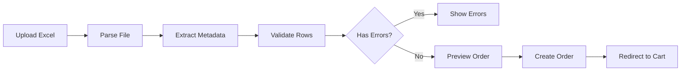

# Excel Order Writer Feature - Final Specification

## Overview

Enable B2B customers to download personalized Excel order forms, work offline, and upload completed forms to automatically create orders. This feature bridges traditional Excel-based workflows with modern digital ordering.

## Business Objectives

- **Support Offline Workflows**: Allow retailers to build orders without constant internet connection
- **Reduce Manual Entry**: Eliminate double-entry when sales reps receive Excel orders via email
- **Maintain Familiarity**: Preserve existing Excel-based processes while modernizing backend
- **Ensure Accuracy**: Auto-validate pricing, SKUs, and inventory to prevent errors

## Technical Architecture

### Core Services

```typescript
// lib/services/excel-order-writer.ts
export class ExcelOrderWriter {
  /**
   * Generate personalized Excel order form
   * Uses existing xlsx library for generation (already installed)
   */
  async generateOrderWorkbook(params: {
    companyId: string
    orderType: 'at-once' | 'prebook' | 'closeout'
    productIds?: string[]  // Optional filter
    season?: string        // For prebook orders
  }): Promise<Buffer>

  /**
   * Parse uploaded Excel and validate
   * Returns parsed order with validation results
   */
  async parseOrderWorkbook(
    buffer: Buffer,
    companyId: string
  ): Promise<{
    items: ParsedLineItem[]
    metadata: OrderMetadata
    validation: ValidationResult
  }>
}
```

### API Endpoints

```typescript
// GET /api/orders/order-writer/template
// Downloads personalized Excel template
export async function GET(request: NextRequest) {
  const { companyId, orderType, productIds } = parseQuery(request)
  const user = await verifySession(request)  // Use existing auth
  
  const buffer = await excelService.generateOrderWorkbook({
    companyId: user.companyId,
    orderType,
    productIds
  })
  
  return new Response(buffer, {
    headers: {
      'Content-Type': 'application/vnd.openxmlformats-officedocument.spreadsheetml.sheet',
      'Content-Disposition': `attachment; filename="order-${orderType}-${Date.now()}.xlsx"`
    }
  })
}

// POST /api/orders/order-writer/import
// Uploads and processes completed Excel
export async function POST(request: NextRequest) {
  const formData = await request.formData()
  const file = formData.get('file') as File
  const buffer = await file.arrayBuffer()
  
  const result = await excelService.parseOrderWorkbook(
    Buffer.from(buffer),
    user.companyId
  )
  
  if (result.validation.hasErrors) {
    return NextResponse.json({
      success: false,
      errors: result.validation.errors
    }, { status: 400 })
  }
  
  // Create order using existing POST /api/orders
  const order = await createOrder(result.items)
  
  return NextResponse.json({
    success: true,
    orderId: order.id,
    warnings: result.validation.warnings
  })
}
```

## Excel Structure

### Visible Sheet: "Order"

| Column | Field | Type | Description | Editable |
|--------|-------|------|-------------|----------|
| A | SKU | String | Product identifier | Read-only |
| B | Quantity | Number | Order quantity | **Editable** |
| C | Description | String | Product name | Read-only |
| D | Variant | String | Size/Color | Read-only |
| E | UPC | String | Barcode | Read-only |
| F | MSRP | Currency | Retail price | Read-only |
| G | Wholesale | Currency | Regular wholesale | Read-only |
| H | Your Price | Currency | Customer-specific price | Read-only |
| I | Line Total | Formula | =B*H | Auto-calculated |
| J | Notes | String | Optional notes | **Editable** |

### Hidden Sheet: "_Meta"

```json
{
  "version": "1.0",
  "generatedAt": "2024-08-13T12:00:00Z",
  "exportId": "exp_abc123",  // Unique ID to prevent duplicates
  "company": {
    "id": "company-1",
    "name": "Outdoor Retailers Co.",
    "pricingTier": "gold"
  },
  "orderType": "closeout",
  "columnMap": {
    "sku": "A",
    "quantity": "B",
    "description": "C",
    "variant": "D",
    "upc": "E",
    "msrp": "F",
    "wholesale": "G",
    "yourPrice": "H",
    "lineTotal": "I",
    "notes": "J"
  },
  "features": {
    "allowPriceOverride": false,
    "enforceMinimums": true,
    "validateInventory": true
  }
}
```

## Data Flow

### Export Flow


1. **Authentication**: Verify user session using existing `verifySession`
2. **Product Loading**: Use `ProductService.getProductsForCompany()`
3. **Catalog Filtering**: Apply `CatalogService.filterByCatalog()`
4. **Pricing**: Calculate via `PricingService.calculateCustomerPrice()`
5. **Generation**: Build Excel with xlsx library
6. **Download**: Stream buffer with proper headers

### Import Flow



1. **Upload**: Multipart form data
2. **Parse**: Extract both sheets using xlsx
3. **Validation**: 
   - SKU exists in catalog
   - Quantities are valid
   - Prices match current (recalculate server-side)
   - Inventory available (warning only)
4. **Preview**: Show parsed order with any warnings
5. **Creation**: Use existing `POST /api/orders`
6. **Redirect**: Send to cart/checkout

## Validation Rules

### Hard Errors (Block Import)
- Unknown SKU/UPC
- Product not in customer's catalog
- Invalid quantity (negative, non-integer)
- File format corrupted
- Version too old (> 2 versions back)

### Soft Warnings (Allow Override)
- Price changed since export (use current price)
- Low inventory (informational)
- Exceeds credit limit (informational in MVP)
- Minimum order quantity not met

### Validation Response
```typescript
interface ValidationResult {
  valid: boolean
  errors: Array<{
    row: number
    column: string
    message: string
    code: 'UNKNOWN_SKU' | 'NOT_IN_CATALOG' | 'INVALID_QTY'
  }>
  warnings: Array<{
    row: number
    message: string
    code: 'PRICE_CHANGED' | 'LOW_INVENTORY' | 'BELOW_MINIMUM'
  }>
}
```

## UI Integration

### Export Buttons

```tsx
// Add to existing order type pages
// /retailer/at-once, /retailer/prebook, /retailer/closeouts

<Button 
  onClick={handleExcelExport}
  variant="outline"
  className="flex items-center gap-2"
>
  <Download className="h-4 w-4" />
  Download Excel Order Form
</Button>
```

### Import Modal

```tsx
// components/features/excel-import-modal.tsx
<Dialog>
  <DialogContent>
    <DialogHeader>
      <DialogTitle>Import Excel Order</DialogTitle>
    </DialogHeader>
    
    {/* Step 1: Upload */}
    <div className="border-2 border-dashed rounded-lg p-8">
      <input 
        type="file" 
        accept=".xlsx,.xlsm"
        onChange={handleFileUpload}
      />
    </div>
    
    {/* Step 2: Validation Results */}
    {validation && (
      <ValidationSummary 
        errors={validation.errors}
        warnings={validation.warnings}
      />
    )}
    
    {/* Step 3: Preview */}
    {parsedOrder && (
      <OrderPreview items={parsedOrder.items} />
    )}
    
    <DialogFooter>
      <Button onClick={handleImport}>
        Create Order ({parsedOrder.items.length} items)
      </Button>
    </DialogFooter>
  </DialogContent>
</Dialog>
```

## Implementation Plan

### Phase 1: MVP (Week 1)
✅ **Day 1-2: Core Service**
- [ ] Create `excel-order-writer.ts` service
- [ ] Implement generation with existing xlsx library
- [ ] Add parsing and validation logic

✅ **Day 3-4: API Endpoints**
- [ ] Create template export endpoint
- [ ] Create import endpoint
- [ ] Connect to existing order creation

✅ **Day 5: Basic UI**
- [ ] Add export buttons to order pages
- [ ] Create simple upload modal
- [ ] Wire up to endpoints

### Phase 2: Enhanced (Week 2)
- [ ] Advanced validation with row-level errors
- [ ] Preview UI with editing capability
- [ ] Template customization per customer
- [ ] Bulk import multiple files

### Phase 3: Production (Week 3)
- [ ] Audit trail and analytics
- [ ] Background processing for large files
- [ ] Email integration for automated processing
- [ ] Comprehensive error recovery

## Technical Decisions

### Library Choice
- **Use existing `xlsx` (0.18.5)** - Already installed and proven
- **Don't add ExcelJS** - xlsx handles our needs, avoid dependency bloat
- **No file-saver needed** - Next.js handles downloads natively
- **No react-dropzone yet** - Simple file input sufficient for MVP

### Security
- All pricing calculated server-side
- Session validation on all endpoints
- Company-scoped data access
- Never trust client-provided totals

### Performance
- Stream large files (>1MB)
- Limit to 10,000 rows initially
- Cache product data during generation
- Background queue for future enhancement

## Testing Strategy

### Unit Tests
```typescript
describe('ExcelOrderWriter', () => {
  it('generates valid Excel with metadata', async () => {
    const buffer = await service.generateOrderWorkbook({...})
    const parsed = xlsx.read(buffer)
    expect(parsed.SheetNames).toContain('Order')
    expect(parsed.SheetNames).toContain('_Meta')
  })
  
  it('round-trips without data loss', async () => {
    const buffer = await service.generateOrderWorkbook({...})
    const parsed = await service.parseOrderWorkbook(buffer)
    expect(parsed.items).toHaveLength(expectedCount)
  })
  
  it('validates SKUs against catalog', async () => {
    const result = await service.parseOrderWorkbook(invalidBuffer)
    expect(result.validation.errors).toContainEqual(
      expect.objectContaining({ code: 'UNKNOWN_SKU' })
    )
  })
})
```

### Integration Tests
- Full export → download → edit → upload → order cycle
- Multiple order types (at-once, prebook, closeout)
- Role-based access (retailer, rep, admin)
- Error scenarios and recovery

### Manual Testing
- Excel compatibility (Excel, Numbers, Google Sheets)
- Large file handling (1000+ rows)
- Network interruption recovery
- Cross-browser file upload

## Success Metrics

- **Adoption**: 30% of orders via Excel within 3 months
- **Accuracy**: <2% validation error rate
- **Performance**: <3 seconds for 1000-row generation
- **Support**: <5% of Excel orders need manual intervention

## Migration Notes

### From Current State
- Orders API exists and supports POST
- Authentication via `verifySession` ready
- Product, Catalog, and Pricing services functional
- Mock data structure supports requirements

### No Breaking Changes
- Additive feature only
- Existing order flow unchanged
- Optional for all users
- Graceful degradation if disabled

## Future Enhancements

### Phase 4+ Considerations
- AI-powered column mapping
- OCR for paper order forms
- Direct email submission (order@company.com)
- FTP/SFTP hot folders
- EDI format support
- Mobile camera capture
- Collaborative editing
- Real-time sync during offline work

## Dependencies Summary

```json
{
  "existing": {
    "xlsx": "^0.18.5"  // Already installed, sufficient for MVP
  },
  "required": {
    // None - we have everything needed
  },
  "future": {
    "exceljs": "^4.3.0",  // If advanced styling needed
    "bull": "^4.10.0",    // For background processing
    "react-dropzone": "^14.2.3"  // For drag-and-drop
  }
}
```

## Conclusion

This Excel Order Writer feature provides a crucial bridge between traditional and modern ordering methods. By leveraging existing services and keeping the implementation focused, we can deliver value quickly while maintaining system integrity and security.

The phased approach allows immediate value delivery while preserving options for enhancement based on user feedback and adoption patterns.